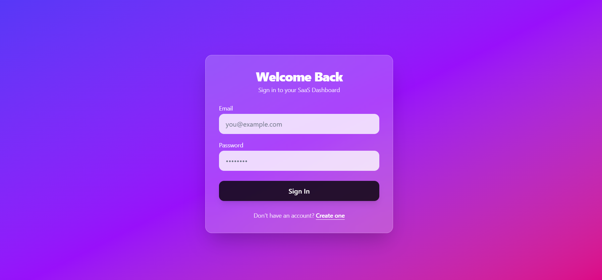
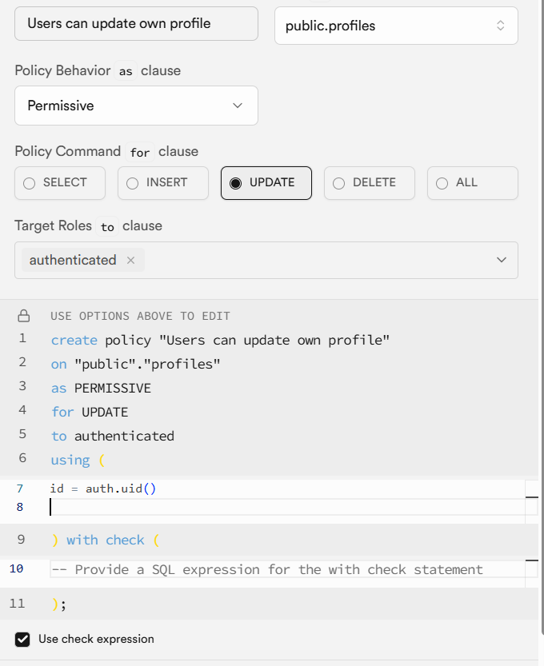
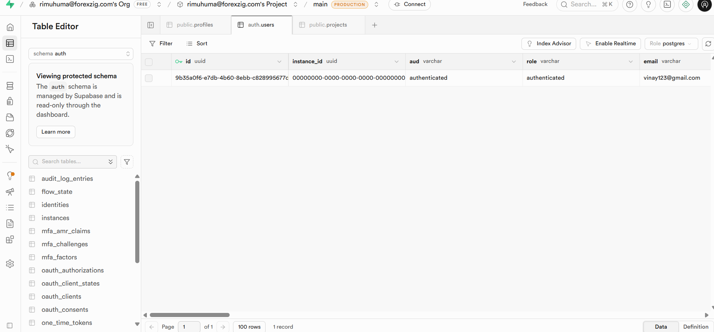
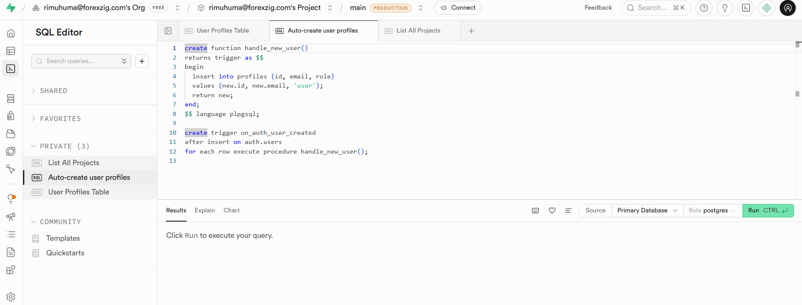
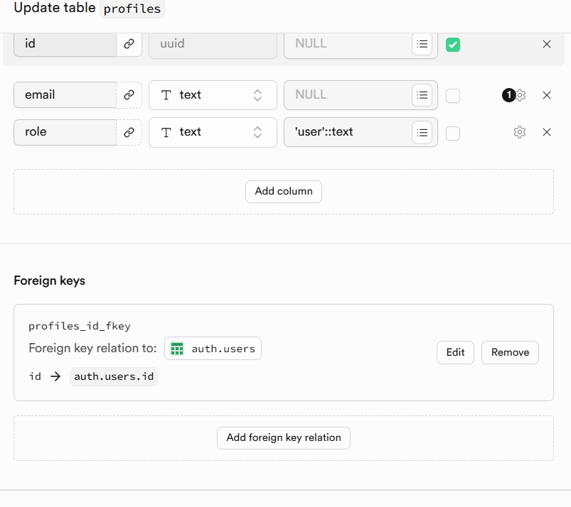
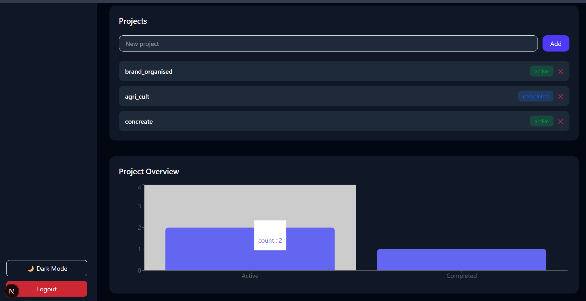
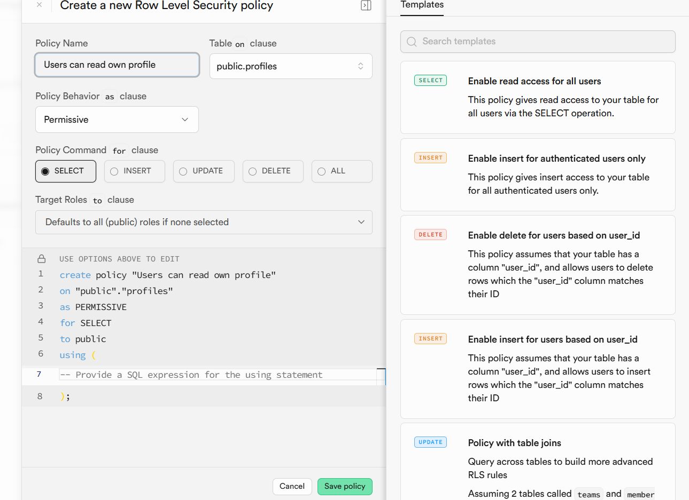
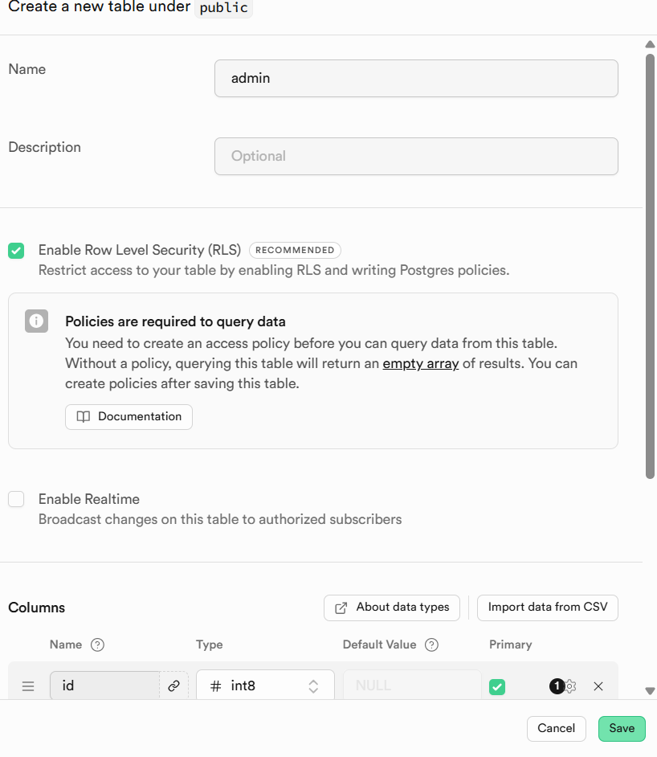

#  SaaS Dashboard – Next.js & Supabase

A modern **SaaS Dashboard application** built using **Next.js (App Router)** and **Supabase**, featuring secure authentication, role-based access control, project management, analytics, and a scalable full-stack architecture.

> ⚠️ **Note**  
> This project is currently running on **localhost**.  
> Due to the large project size (~650 MB), the full source code is not yet pushed to GitHub working on solution to fix this.  
> This repository documents the complete system using **real application screenshots**.

---

## ✨ Features

- 🔐 Email & Password Authentication (Supabase Auth)
- 🧑‍💼 Role-based Access Control (User / Admin-ready)
- 🔒 Row Level Security (RLS)
- 📁 Project Management (Create, Read, Status Tracking)
- 📊 Dashboard Analytics (Active vs Completed Projects)
- ⚙️ PostgreSQL Triggers & Functions
- 🌙 Dark Mode UI
- 📱 Fully Responsive SaaS Layout
- 🚀 Production-ready Architecture

---

## 🛠️ Tech Stack

| Layer        | Technology |
|-------------|------------|
| Frontend    | Next.js 16 (App Router) |
| Backend     | Supabase (PostgreSQL + Auth) |
| Language    | TypeScript |
| Styling     | Tailwind CSS |
| Charts      | Recharts |
| Auth        | Supabase Auth |

---

## 🔐 Authentication System

Secure email and password authentication implemented using **Supabase Auth**.

  

### Highlights
- Supabase-managed authentication
- Secure session handling
- Protected routes (Dashboard, Projects)
- Automatic user provisioning

---

## ⚙️ Automatic User Profile Creation (Database Trigger)

A PostgreSQL trigger automatically creates a user profile when a new user signs up.

  

### Logic
- Trigger runs `AFTER INSERT` on `auth.users`
- Inserts data into `public.profiles`
- Assigns default role as `user`

---

## 👤 Profiles Table

Each authenticated user has a corresponding profile entry.

  

### Columns
- `id` (UUID → auth.users.id)
- `email`
- `role` (`user` / future `admin`)

---

## 🔒 Row Level Security (RLS)

Database-level security enforced using **Supabase RLS**.

### ✅ Read Own Profile Policy

  

- Users can only read their own profile
- Condition: `id = auth.uid()`

---

### ✏️ Update Own Profile Policy

  

- Only authenticated users
- Users can update **only their own data**

---

## 📊 Dashboard Overview

The main SaaS dashboard displays project statistics.

  

### Metrics
- Total Projects
- Active Projects
- Completed Projects

---

## 📁 Project Management

Users can manage projects directly from the dashboard.

  

### Capabilities
- Create projects
- View personal projects
- Status tracking (`active`, `completed`)
- User-level data isolation

---

## 🗄️ Projects Table (Supabase)

  

### Schema
- `id` (UUID)
- `name`
- `status`
- `user_id` (FK → auth.users.id)
- `created_at`

---

## 👥 Auth Users Table

Supabase-managed authentication users table.

  

---

## 📈 Supabase Monitoring & Analytics

Real-time backend usage statistics provided by Supabase.

  

### Metrics
- Database REST requests
- Authentication requests
- System activity monitoring

---

## 🧠 System Architecture

- **Next.js frontend** communicates directly with Supabase
- **Supabase Auth** manages sessions
- **PostgreSQL RLS** ensures row-level security
- **Triggers & functions** automate backend logic
- Fully **serverless SaaS architecture**

---

## 🚧 Project Status

- 🧪 Running on localhost
- 📦 Codebase size ~650 MB
- 📸 Fully documented via screenshots
- 🚀 Ready for cloud deployment

---

## 🔮 Future Enhancements

- Admin dashboard
- Team-based project collaboration
- Subscription & payment integration
- Deployment to Vercel
- CI/CD pipeline

---

## 👨‍💻 Author

**SaaS Dashboard**  
An advanced full-stack project demonstrating real-world SaaS architecture, security, and database design using **Next.js & Supabase**.

---

⭐ If you like this project, consider starring the repository!
