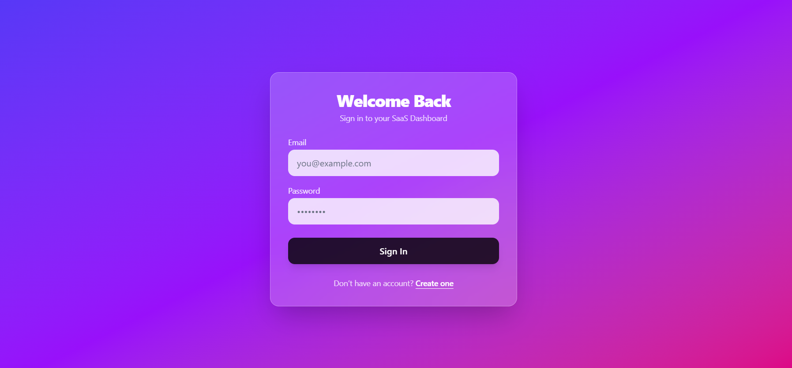
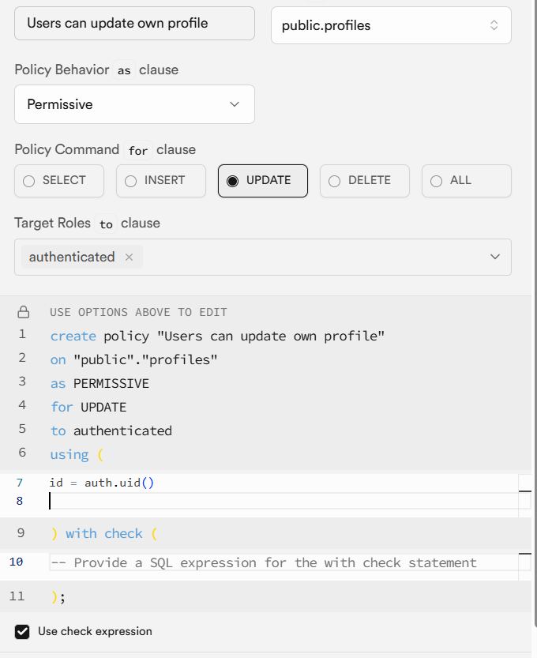
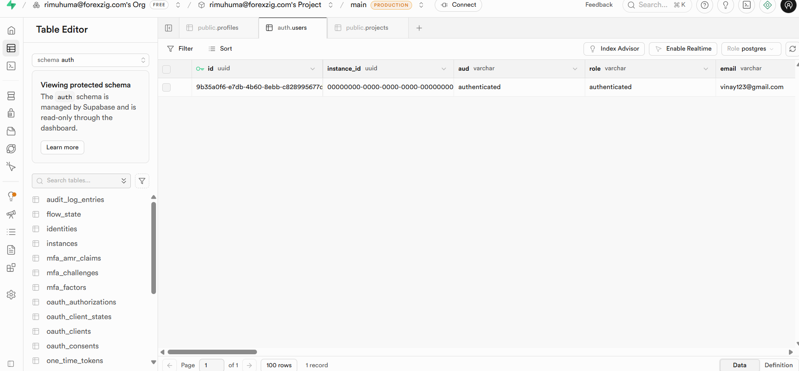
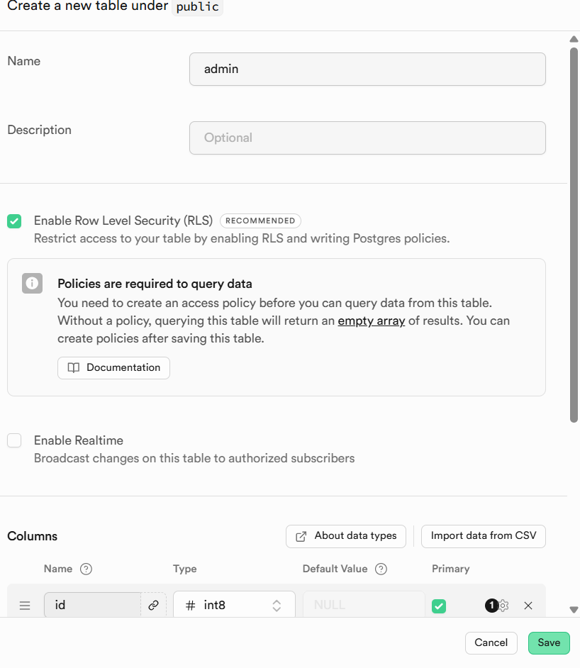
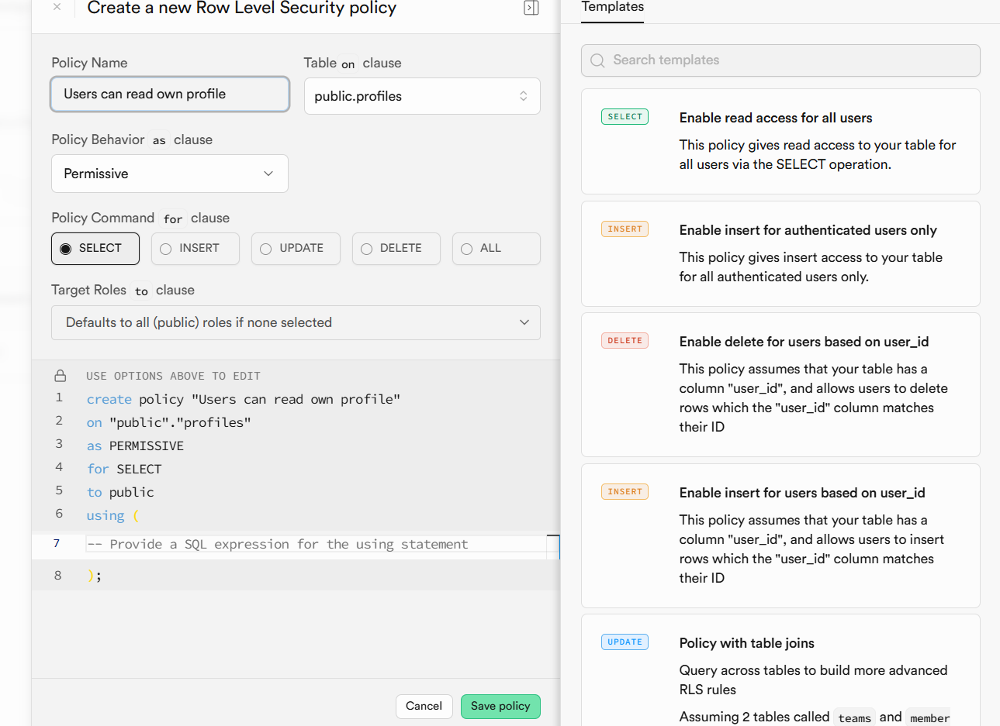
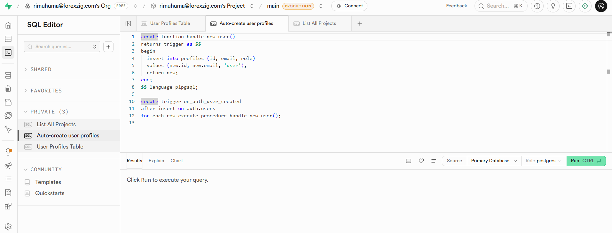
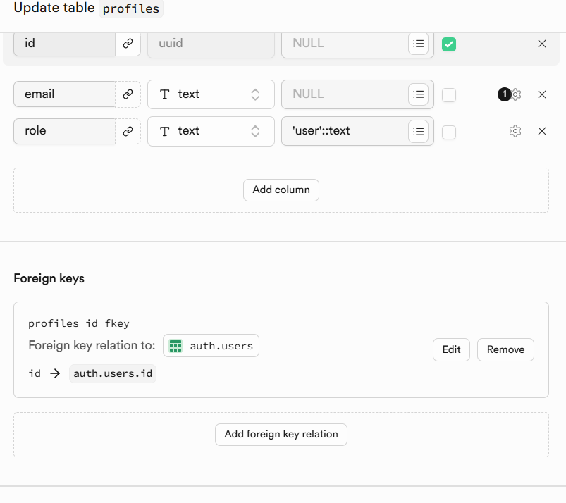
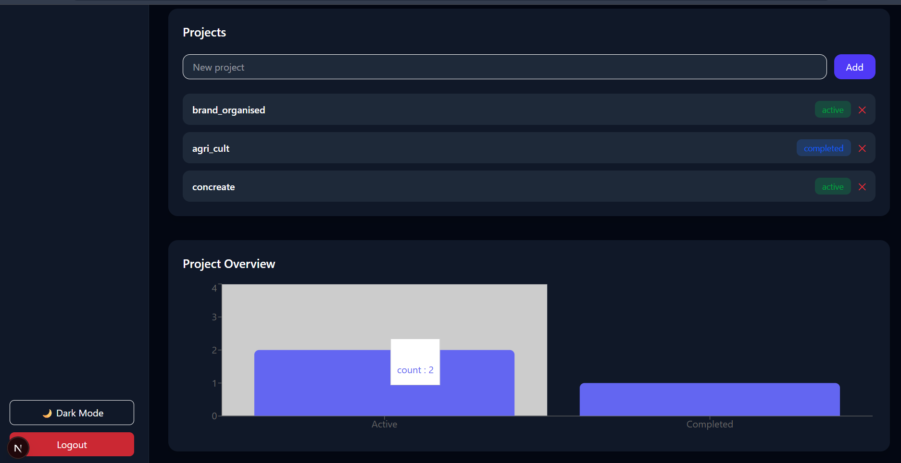
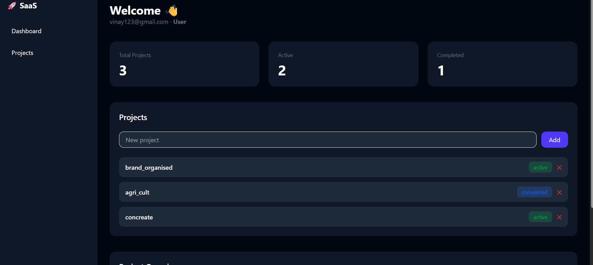

<div align="center">


</div>

<div align="center">


<br/><br/>

[](https://nextjs.org)
[](https://supabase.com)
[](https://typescriptlang.org)
[](https://tailwindcss.com)
[](https://recharts.org)
[](LICENSE)

<br/>

> ⚠️ **Project Note** — Currently running on **localhost** · Codebase ~650 MB  
> Full source push in progress · **Fully documented via real application screenshots below I solve that problem get learn from that alot **

<br/>

**[📸 View Screenshots](#-application-screenshots)** &nbsp;·&nbsp; **[🏗️ Architecture](#-system-architecture)** &nbsp;·&nbsp; **[🔐 Auth System](#-authentication-system)** &nbsp;·&nbsp; **[🚀 Roadmap](#-future-enhancements)**

</div>

---

## 📑 Table of Contents

- [Overview](#-overview)
- [Feature Highlights](#-feature-highlights)
- [Tech Stack](#️-tech-stack)
- [System Architecture](#-system-architecture)
- [Authentication System](#-authentication-system)
- [Database Design](#️-database-design)
- [Row Level Security](#-row-level-security-rls)
- [Dashboard & Analytics](#-dashboard--analytics)
- [Project Management](#-project-management)
- [Application Screenshots](#-application-screenshots)
- [Run Locally](#-run-locally)
- [Environment Setup](#-environment-variables)
- [Project Status](#-project-status)
- [Future Enhancements](#-future-enhancements)
- [Contributing](#-contributing)
- [Contact](#-contact)

---

## 🔍 Overview

A production-grade **full-stack SaaS Dashboard** engineered with the latest **Next.js 16 App Router** and **Supabase** backend. This is not a tutorial project — it's a real-world architecture demonstrating how modern SaaS products are built securely at scale.

```
╔═══════════════════════════════════════════════════════════════╗
║                  WHAT MAKES THIS DIFFERENT?                   ║
║                                                               ║
║  ✅ Real PostgreSQL RLS — not fake auth                       ║
║  ✅ DB Triggers & Functions — not manual inserts              ║
║  ✅ Role-based access — User / Admin architecture             ║
║  ✅ Serverless SaaS pattern — Vercel + Supabase ready         ║
║  ✅ Dark mode, responsive, real analytics                     ║
╚═══════════════════════════════════════════════════════════════╝
```

Built to demonstrate:
- 🔐 **Enterprise-level security** with PostgreSQL Row Level Security
- 🧠 **Smart backend automation** via database triggers
- 📊 **Real analytics** from live Supabase data
- 📱 **Responsive SaaS UI** with dark mode

---

## ✨ Feature Highlights

<div align="center">

| Category | Feature | Status |
|---|---|---|
| 🔐 **Auth** | Email & Password Authentication | ✅ Live |
| 🔐 **Auth** | Protected route middleware | ✅ Live |
| 🔐 **Auth** | Automatic session management | ✅ Live |
| 🧑‍💼 **Access** | Role-Based Access Control (User / Admin) | ✅ Live |
| 🔒 **Security** | Row Level Security (RLS) | ✅ Live |
| 🔒 **Security** | Read Own Profile Policy | ✅ Live |
| 🔒 **Security** | Update Own Profile Policy | ✅ Live |
| 📁 **Projects** | Create & manage projects | ✅ Live |
| 📁 **Projects** | Status tracking (Active / Completed) | ✅ Live |
| 📁 **Projects** | User-level data isolation | ✅ Live |
| 📊 **Analytics** | Total / Active / Completed project metrics | ✅ Live |
| 📊 **Analytics** | Recharts visual graphs | ✅ Live |
| ⚙️ **Database** | PostgreSQL triggers & functions | ✅ Live |
| 🌙 **UI/UX** | Dark Mode interface | ✅ Live |
| 📱 **UI/UX** | Fully responsive layout | ✅ Live |
| 🚀 **Infra** | Production-ready architecture | ✅ Live |

</div>

---

## 🛠️ Tech Stack

<div align="center">

| Layer | Technology | Purpose |
|---|---|---|
| ⚛️ **Frontend** | Next.js 16 (App Router) | SSR, routing, React server components |
| 🗄️ **Backend** | Supabase (PostgreSQL) | Database, Auth, Realtime, Storage |
| 🔤 **Language** | TypeScript (Strict) | Type-safe full-stack development |
| 🎨 **Styling** | Tailwind CSS | Utility-first responsive design |
| 📈 **Charts** | Recharts | Analytics & data visualization |
| 🔐 **Auth** | Supabase Auth | Session management & user provisioning |
| 🌐 **Deployment** | Vercel (planned) | Edge deployment for Next.js |

</div>

<br/>

<div align="center">


</div>

---

## 🏗️ System Architecture

```
╔══════════════════════════════════════════════════════════════════╗
║                        CLIENT BROWSER                            ║
║           Next.js 16 App Router (React Server Components)        ║
╚════════════════════════════╤═════════════════════════════════════╝
                             │  HTTPS / Supabase JS Client
╔════════════════════════════▼═════════════════════════════════════╗
║                       SUPABASE PLATFORM                          ║
║  ┌─────────────┐  ┌─────────────┐  ┌──────────────────────────┐ ║
║  │  Supabase   │  │  PostgreSQL │  │   Row Level Security     │ ║
║  │    Auth     │  │  Database   │  │   (Per-user isolation)   │ ║
║  │  (Sessions) │  │ (profiles + │  │   auth.uid() policies    │ ║
║  │             │  │  projects)  │  │                          │ ║
║  └──────┬──────┘  └──────┬──────┘  └──────────────────────────┘ ║
║         │                │                                        ║
║  ┌──────▼──────────────── ▼──────────────────────────────────┐  ║
║  │           PostgreSQL Triggers & Functions                  │  ║
║  │  AFTER INSERT on auth.users → auto-create public.profile  │  ║
║  └────────────────────────────────────────────────────────────┘  ║
╚══════════════════════════════════════════════════════════════════╝
                             │
╔════════════════════════════▼═════════════════════════════════════╗
║                       NEXT.JS MIDDLEWARE                         ║
║         Route protection · Session validation · Redirects        ║
╚════════════════════════════╤═════════════════════════════════════╝
                             │
       ┌─────────────────────┼─────────────────────┐
       ▼                     ▼                     ▼
  /dashboard            /projects             /auth/login
  Analytics &           CRUD +                Sign in /
  metrics               status tracking       Sign up
```

**Key architectural decisions:**
- **No custom backend server** — Supabase handles all backend logic
- **RLS at DB level** — security enforced in PostgreSQL, not just frontend
- **Triggers automate** user profile creation on signup
- **React Server Components** used for data fetching where possible

---

## 🔐 Authentication System

Secure email/password authentication via **Supabase Auth** with automatic session management and protected routes.

<p align="center">
  
</p>

### How Auth Works

```
User submits email + password
         │
         ▼
Supabase Auth validates credentials
         │
         ▼
JWT session token issued → stored in secure httpOnly cookie
         │
         ▼
Next.js middleware reads session on every request
         │
   ┌─────┴──────┐
   ▼            ▼
Authenticated  Not Authenticated
→ Dashboard    → Redirect to /login
```

### Security Features
- ✅ Supabase-managed authentication — no password stored in your DB
- ✅ Secure HTTP-only session cookies
- ✅ Protected routes via Next.js middleware
- ✅ Automatic user provisioning via DB trigger

---

## 🗄️ Database Design

### Schema Overview

```sql
-- Auth users (managed by Supabase)
auth.users
  ├── id          UUID  PRIMARY KEY
  ├── email       TEXT
  └── created_at  TIMESTAMPTZ

-- Public profiles (auto-created via trigger)
public.profiles
  ├── id          UUID  → auth.users.id  (FK)
  ├── email       TEXT
  ├── role        TEXT  DEFAULT 'user'   (user | admin)
  └── created_at  TIMESTAMPTZ

-- Projects (per-user, RLS-protected)
public.projects
  ├── id          UUID  PRIMARY KEY
  ├── name        TEXT  NOT NULL
  ├── status      TEXT  DEFAULT 'active' (active | completed)
  ├── user_id     UUID  → auth.users.id  (FK)
  └── created_at  TIMESTAMPTZ
```

### Auto Profile Creation Trigger

```sql
-- Trigger function: runs after every new user signup
CREATE OR REPLACE FUNCTION public.handle_new_user()
RETURNS TRIGGER AS $$
BEGIN
  INSERT INTO public.profiles (id, email, role)
  VALUES (
    NEW.id,
    NEW.email,
    'user'           -- default role
  );
  RETURN NEW;
END;
$$ LANGUAGE plpgsql SECURITY DEFINER;

-- Attach trigger to auth.users
CREATE TRIGGER on_auth_user_created
  AFTER INSERT ON auth.users
  FOR EACH ROW
  EXECUTE FUNCTION public.handle_new_user();
```

<p align="center">
  
</p>

### Profiles Table

<p align="center">
  
</p>

### Auth Users Table

<p align="center">
  
</p>

### Projects Table

<p align="center">
  
</p>

---

## 🔒 Row Level Security (RLS)

**Row Level Security** ensures users can only access their own data — enforced at the **PostgreSQL database level**, not just the application layer.

```sql
-- ✅ Policy 1: Users can only READ their own profile
CREATE POLICY "Users can read own profile"
  ON public.profiles
  FOR SELECT
  USING ( id = auth.uid() );

-- ✅ Policy 2: Users can only UPDATE their own profile
CREATE POLICY "Users can update own profile"
  ON public.profiles
  FOR UPDATE
  USING ( id = auth.uid() );

-- ✅ Policy 3: Users can only see their own projects
CREATE POLICY "Users can view own projects"
  ON public.projects
  FOR SELECT
  USING ( user_id = auth.uid() );

-- ✅ Policy 4: Users can only insert their own projects
CREATE POLICY "Users can create own projects"
  ON public.projects
  FOR INSERT
  WITH CHECK ( user_id = auth.uid() );
```

> 💡 **Why RLS matters:** Even if your frontend has a bug that exposes another user's ID, the database **will not return that data**. Security is enforced at the lowest possible level.

### Read Own Profile Policy

<p align="center">
  
</p>

### Update Own Profile Policy

<p align="center">
  
</p>

---

## 📊 Dashboard & Analytics

The main dashboard delivers real-time project statistics pulled live from Supabase.

<p align="center">
  
</p>

### Metric Cards

| Metric | Source | Description |
|---|---|---|
| 📁 **Total Projects** | `COUNT(*)` from projects | All projects for the current user |
| ⚡ **Active Projects** | `WHERE status = 'active'` | Currently in-progress projects |
| ✅ **Completed Projects** | `WHERE status = 'completed'` | Successfully finished projects |

### Charts (Recharts)
- **Bar chart** — project status breakdown
- **Line chart** — project creation over time
- All charts are populated with **live Supabase data**

---

## 📁 Project Management

Full CRUD project management with user-level data isolation enforced by RLS.

<p align="center">
  
</p>

### Capabilities

```
Create Project   →  Name + default status 'active'
View Projects    →  Only current user's projects (RLS enforced)
Update Status    →  Toggle between 'active' and 'completed'
Delete Project   →  Remove from database with confirmation
```

### Status Lifecycle

```
[Created] → active → completed
                ↑         │
                └─────────┘  (can revert)
```

---

## 📸 Application Screenshots

<div align="center">

### 🔐 Authentication


---

### 📊 Main Dashboard


---

### 📁 Project Management


---

### ⚙️ Supabase Database — Trigger Setup


---

### 👤 Profiles Table


---

### 🔒 RLS — Read Policy


---

### ✏️ RLS — Update Policy


---

### 🗄️ Projects Table Schema


---

### 👥 Auth Users Table


</div>

---

## 🚀 Run Locally

### Prerequisites
- Node.js **18+**
- A free [Supabase](https://supabase.com) account
- Git

### Setup

**1. Clone the repository**
```bash
git clone https://github.com/iiiii0vicky0-0singh0iiiii/saas-dashboard.git
cd saas-dashboard
```

**2. Install dependencies**
```bash
npm install
# or
yarn install
```

**3. Set up environment variables**
```bash
cp .env.example .env.local
```

---

## 🔑 Environment Variables

Add these to your `.env.local` file:

```env
# Supabase Project Settings
NEXT_PUBLIC_SUPABASE_URL=https://your-project-id.supabase.co
NEXT_PUBLIC_SUPABASE_ANON_KEY=your-anon-key-here

# Optional: For server-side operations
SUPABASE_SERVICE_ROLE_KEY=your-service-role-key-here
```

> 🔍 Find these in your Supabase project → **Settings → API**

**4. Set up the database**

Run these SQL scripts in your Supabase SQL Editor (in order):
```
1. Create profiles table
2. Create projects table
3. Enable RLS on both tables
4. Add RLS policies
5. Create handle_new_user() trigger
```

**5. Start the development server**
```bash
npm run dev
```

> 🌐 Open `http://localhost:3000`

---

## 📊 Project Status

<div align="center">

| Item | Status |
|---|---|
| 🧪 Running Environment | Localhost (development) |
| 📦 Codebase Size | ~650 MB |
| 📸 Documentation | Complete via screenshots |
| 🚀 Cloud Deployment | Planned — Vercel |
| 📂 GitHub Push | In progress (large repo) |
| 🔐 Auth System | ✅ Complete |
| 🔒 RLS Policies | ✅ Complete |
| 📊 Analytics | ✅ Complete |
| 📁 Project CRUD | ✅ Complete |
| 🌙 Dark Mode | ✅ Complete |

</div>

---

## 🔮 Future Enhancements

- [ ] 🔲 **Admin Dashboard** — separate admin panel with user management
- [ ] 🔲 **Team Collaboration** — invite members, shared projects
- [ ] 🔲 **Subscription & Payments** — Stripe integration for SaaS billing
- [ ] 🔲 **Vercel Deployment** — live production URL
- [ ] 🔲 **CI/CD Pipeline** — GitHub Actions for automated testing & deploy
- [ ] 🔲 **Email Notifications** — project updates via Supabase Edge Functions
- [ ] 🔲 **File Uploads** — project attachments using Supabase Storage
- [ ] 🔲 **Audit Logs** — track all user actions
- [ ] 🔲 **2FA Support** — two-factor authentication
- [ ] 🔲 **API Rate Limiting** — throttle requests per user

---

## 🤝 Contributing

This project is currently in active development. Contributions and suggestions are welcome!

1. **Fork** the repository
2. **Create** a branch → `git checkout -b feature/YourFeature`
3. **Commit** → `git commit -m "Add: YourFeature"`
4. **Push** → `git push origin feature/YourFeature`
5. **Open** a Pull Request

---

## 📬 Contact

<div align="center">

[](mailto:indianarmysniper@gmail.com)
[](https://github.com/iiiii0vicky0-0singh0iiiii)
[](https://linkedin.com/in/yourprofile)

<br/>


</div>

---

<div align="center">


*Built with 💙 by **Vicky Kumar Singh***

*"Real security lives in the database, not just the frontend."* 🔒

</div>
